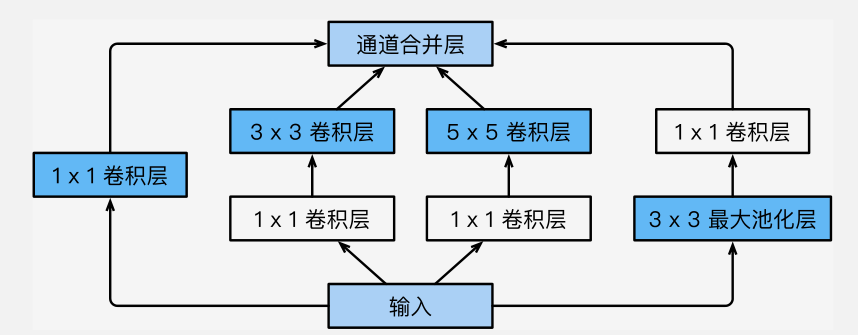
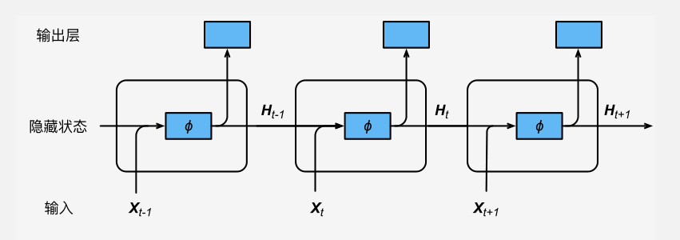

# 术语准备

> - End-to-end（端对端）：直接基于原始图像的原始像素进行分类

# LeNet

- 主要结构：卷积层快，全连接成块
  - 激活函数：Sigmoid
- 解决问题（相较于简单全连接层）：
  - 相隔较远的模式结构难以被识别
  - 全连接层参数体量过于庞大
- 不足：
  - 参数量仍然较大，在更大的真实数据集上表现不尽如人意
  - 没有使用丢弃法，无法控制模全连接层的复杂度
- 适合场景：
  - 早期小数据集

# AlexNet（2012）

（注：现在已经不再需要这样的双数据流设计）

- 主要结构：5卷积池化+2全连接
  - ReLU 激活函数
  - DropOut
- 解决问题（相较于 LeNet）
  - 处理更大的图片
  - 缓解梯度消失问题（Sigmoid 改为 ReLU）
  - 控制全连接层的复杂程度（DropOut）
  - 引入大量图像增广，可以进一步扩大数据集缓解过拟合
- 不足：虽然指明深度卷积神经网络可以取得出色的结果，但是没有为后续研究者设计网络提供简单的规则

# VGG

> 可以通过重复使用简单的基础块来构建深度模型的思路

- 主要结构：8卷积层+3全连接层
  - 5卷积层：前两个单卷积层，后三个双卷积层，共计8次卷积
  - **VGG 块**：padding = 1，kernel_size = 3，strde = 2 卷积（大小不变）+ kernel_size = 2 最大池化（大小减半）

- 解决问题：引入可重复使用的单元
- 不足：计算相比 AlexNet 更加复杂

# NIN

> 网络中的网络，用 1*1 卷积层来代替全连接层，将空间信息传递到后面的层中

- 主要结构：用 1*1 卷积层代替全连接层
  - **NIN 块**：

# GoogLeNet

- Inception 块  
  - 四条并行的线路
  - 可自定义每个层输出通道数来控制模型复杂度

- GoogLeNet
  - 由 5 个模块组成，对于不同尺寸的图片均适用，Inception 模块的构造保证了其可以根据输入图片的尺寸灵活调整大小，需要控制的是通道数目
  - 其中 Inception 模块通道分配之比是在 ImageNet 数据集上通过大量的实验得来的

# DenseNet

>  和 ResNet 的区别：ResNet 将结果相加，而稠密连接网络把输出的层堆叠到一起。

- 主要结构：稠密快（dense block），过渡层（transition layer）
  - 稠密快

# 

# 循环神经网络

> 提出背景：语言模型的 trade-off，直接用概率模型存储和计算都复杂，n-gram 会损失部分准确性

## 语言模型回顾

- 主要思想：预测文本序列的概率 $P(w_1, w_2,...,w_r) = \displaystyle\prod_{t=1}^{T}{p(w_t|w_1,...,w_{t-1})}$
  - 各个条件概率都从语料库得到

  - 缺点：计算和储存多个词共同出现的概率的复杂度会呈指数级增加，可用 $n$ 阶马尔可夫链进行简化，但会牺牲部分概率的准确性
    - 即一个词的出现只与前面的 $n$ 个词相关
    - 也称 n-gram（$n-1$) 阶马尔可夫链的概率语言模型

## 循环神经网络

- 在时间 $t$ 包含两种操作（输入 $X_t$）
  - 隐藏状态的更新：$H_t = \phi(X_tW_{xh}+H_{t-1}W_{hh}+b_h)$
  - 当前位置的输出：$O_t = H_tW_{hq} + b_q$
- 隐藏层消息传递的权重和偏差 $W_{hh},b_h$ 共用，每个时间节点输出的权重和偏差 $W_{xq}, b_q$ 共用，当前输入信息利用的权重$W_{xh}$ 也共用，故循环神经网络模型参数的数量不随时间步的增加而增长
- 字符级神经循环神经网络计算更加简单（每一个输入词是一个字符而不是词语）