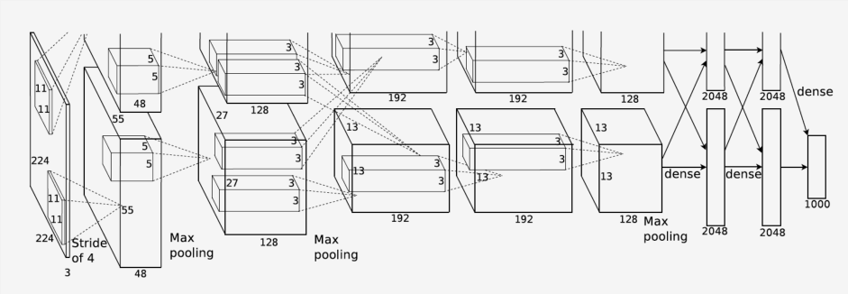

# 术语准备

> - End-to-end（端对端）：直接基于原始图像的原始像素进行分类

# LeNet

- 主要结构：卷积层快，全连接成块
  - 激活函数：Sigmoid
- 解决问题（相较于简单全连接层）：
  - 相隔较远的模式结构难以被识别
  - 全连接层参数体量过于庞大
- 不足：
  - 参数量仍然较大，在更大的真实数据集上表现不尽如人意
  - 没有使用丢弃法，无法控制模全连接层的复杂度
- 适合场景：
  - 早期小数据集

# AlexNet（2012）

（注：现在已经不再需要这样的双数据流设计）

- 主要结构：5卷积池化+2全连接
  - ReLU 激活函数
  - DropOut
- 解决问题（相较于 LeNet）
  - 处理更大的图片
  - 缓解梯度消失问题（Sigmoid 改为 ReLU）
  - 控制全连接层的复杂程度（DropOut）
  - 引入大量图像增广，可以进一步扩大数据集缓解过拟合
- 不足：虽然指明深度卷积神经网络可以取得出色的结果，但是没有为后续研究者设计网络提供简单的规则

# VGG

> 可以通过重复使用简单的基础块来构建深度模型的思路

- 主要结构：8卷积层+3全连接层
  - 5卷积层：前两个单卷积层，后三个双卷积层，共计8次卷积
  - **VGG 块**：padding = 1，kernel_size = 3，strde = 2 卷积（大小不变）+ kernel_size = 2 最大池化（大小减半）

- 解决问题：引入可重复使用的单元
- 不足：计算相比 AlexNet 更加复杂

# NIN

> 网络中的网络，用 1*1 卷积层来代替全连接层，将空间信息传递到后面的层中

- 主要结构：用 1*1 卷积层代替全连接层
  - **NIN 块**：

